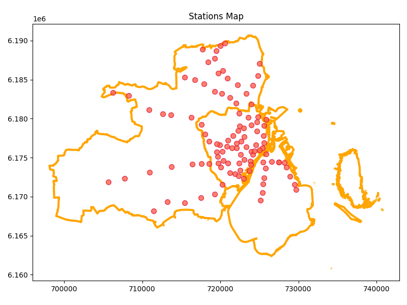
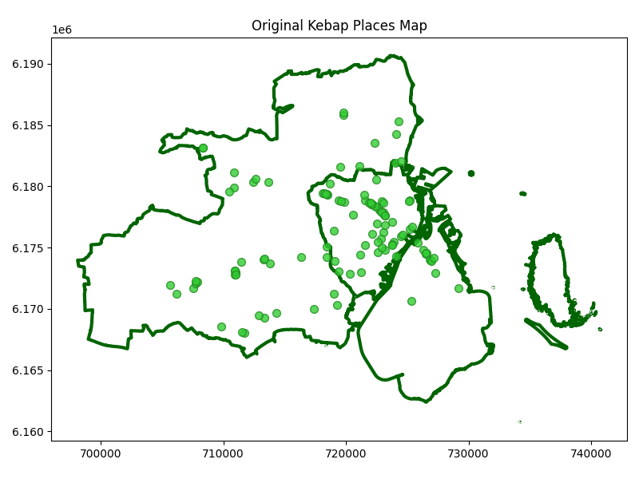
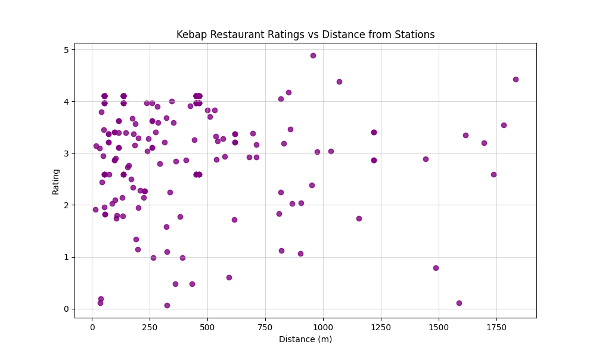

# Kebap Analysis: Testing the Train Station Proximity Hypothesis
A spatial analysis project investigating whether kebab quality correlates with distance from train stations in Greater Copenhagen.

## Project Overview
Inspired by [this Reddit post](https://www.reddit.com/r/gis/comments/1iph0yy/the_closer_to_the_railway_station_the_less_tasty/) I decided to test it out within the Greater Copenhagen area.  
This project combines:
- Spatial analysis with Python
- Data extraction from QGIS 
- Data collection via Google Places API
- Interactive web map visualization

### Key Findings:
- Sample size: 112 kebab restaurants, 107 train/metro stations
- Correlation: No statistically significant relationship found (p > 0.05)
- Conclusion: The hypothesis does not hold for Greater Copenhagen. 

## Interactive Map
[View the interactive map here](https://scet2.github.io/Kebap_Analysis/qgis2web_2025_10_11-11_24_59_122720)

## Study Area Selection
I chose Greater Copenhagen for several reasons:
- Familiarity: I have local knowledge of the data
- Data availability: Good coverage in OpenStreetMap for both stations and restaurants
- Urban diversity: Expanded from Copenhagen proper to include suburban areas for more varied density patterns 
Initially, I begin with Copenhagen city, but the extreme density limited variability. You're almost always within walking distance to a station, thus I expanded to Greater Copenhagen to introduce more diverse urban patterns and capture restaurants at varying distances from stations. However all kebab places still fell within 2km of a station. 
Interestingly, plotting the kebab locations essentially reveals the train/metro network lines, revealing the strong influence of transit infrastructure have on (kebab) restaurant location choices.

<table>
  <tr>  
    <td></td>
    <td></td>
  </tr>
</table>

_Distribution of train/metro stations (red) and kebab restaurants (green) across Greater Copenhagen_

## Methodology

### 1.Data Collection
**Sources:**
- Kebab restaurants: OpenStreetMap via QGIS + manual verification
- Metro/Train stations: OpenStreetMap via QGIS + manual verification
- Ratings: Google Places API (automated collection)
- Study area boundary: [data-science.dk](https://data-science.dk/)

**Initial data summary:**
- 129 stations
- 117 kebab restaurants  
Before cleaning/filtering

### 2.Data Cleaning & Preparation
**Station Filtering:**
- Removed 23 stations located outside or at the egde of the study area boundary
- Exlcuded some 'lokalbane' (local railway) stations that provided limited additional information
- Removed duplicate entried (e.g., Vanløse, Hovedbanegården appearing both as metro and train stations)
- **Final count:** 107 stations

**Restaurant Cleaning:**
- Identified and handled chain restaurants to avoid duplicate locations
- Example: Removed one Konya Kebab branch which was outside the study area
- Removed restaurants outside the boundary
- **Final Count:** 112 kebab restaurants

**Rating Collection:**
- Used Google Places API to automatically fetch current ratings for each restaurant
- Dropped entries with missing rating data (1 restaurant)

### 3. Distance Calculation
**Metric Choice: Euclidean Distance**  
While walking distance would be more realistic for actual customer travel, it would also be computationally expensive. Additionally, in Copenhagen's dense urban environment the Euclidean distance will highly likely provide similar numbers. The walking distance would give more precise absolute values but the ranking of which station is closest remains consistent across metrics. And since the analysis focuses on relative proximity rather than absolute distances, Euclidean distance is appropriate and computationally efficient. 
 
For each kebab restaurant, I calculated the Euclidean distance to all 107 stations and identified the closest one.

### 4. Statistical Analysis
**Correlation Tests:**
- Spearman's Rank and Pearson's Correlation were both applied to assess wether distance from nearest station correlates with restaurant rating.

## Results

_Relationship between distance to nearest station (km) and Google rating. No clear pattern visible._

**Correlation Coefficients:**
- Spearman's ρ = 0.002 (p = 0.9797)
- Pearson's r = -0.055 (p = 0.4528)
  
**Interpretation:**
- There is essentially no meaningful correlation between distance and rating, as both correlation coefficients are very weak (close to zero).
-  Neither of the two correlation metrics reached the statistical significance at 0.05 level.
-  Thus we fail to reject the null hypothesis of no relationship between distance and rating.
-  Any observed correlation could easily be due to random chance.
-  The hypothesis remains unproven in this context.

## Limitations
- Sample size: 112 Restaurants may be insufficient to detect any effect.
- Distance range: Limited variability due to Copenhagen's density.
- Rating bias: Google ratings may not perfectly reflect food quality
- Other variables: rent prices, foot traffic, competition... 

  
